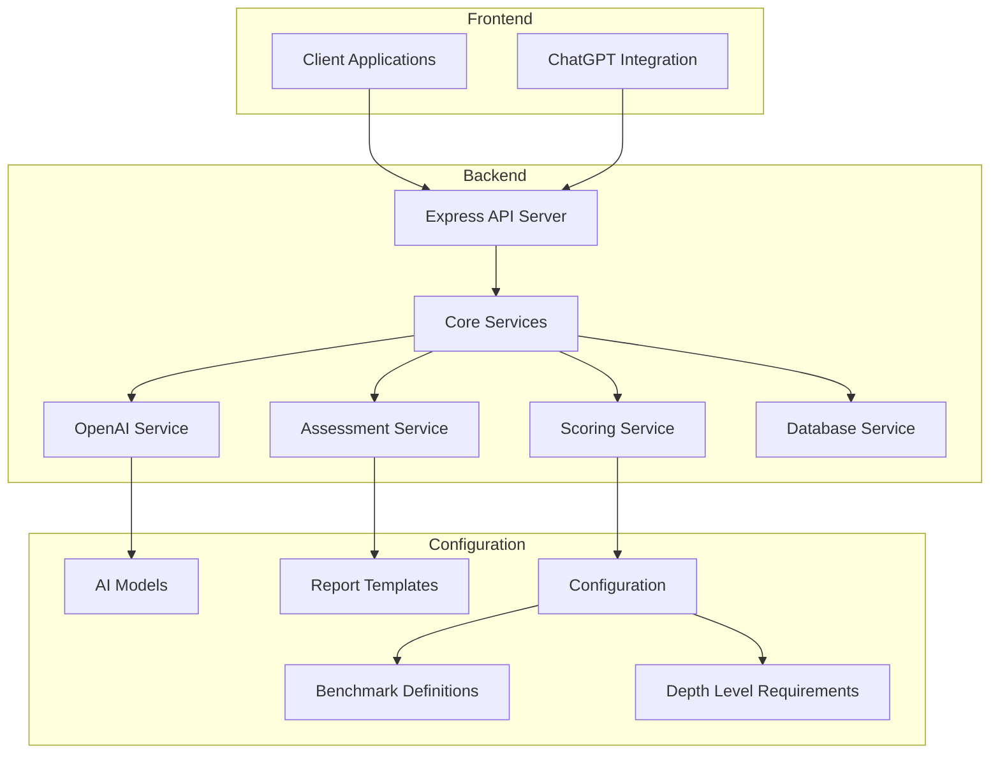
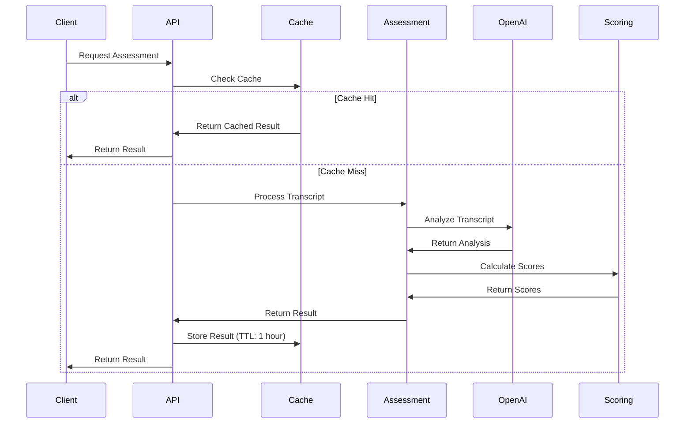

# CMO Assessment Tool - Architecture Overview

This document provides a comprehensive overview of the CMO Assessment Tool's architecture, including core components, data flow, integration points, and technology stack.

## System Architecture

## Core Components

### Client Applications

- **Web Application**: React-based UI for uploading transcripts and viewing assessments
- **ChatGPT Integration**: Custom GPT for direct transcript assessment
- **API Clients**: Any third-party applications consuming the assessment API

### API Layer

- **Express Server**: Node.js server handling all API requests
- **Endpoints**:
  - `/api/assessment`: Main assessment endpoint for web clients
  - `/api/chatgpt/assessment`: Specialized endpoint for ChatGPT integration
  - `/api/reports/:id`: Retrieves specific report data
  - `/api/profiles/:id`: Retrieves CMO profile data

### Core Services

#### OpenAI Service

Handles all interactions with the OpenAI API.

- **Responsibilities**:
  - Sending transcript data to OpenAI models
  - Processing and validating AI responses
  - Extracting structured data from AI outputs
  - Error handling and retries

#### Assessment Service

Coordinates the overall assessment process.

- **Responsibilities**:
  - Transcript validation and preprocessing
  - Orchestrating the assessment workflow
  - Profile creation and management
  - Report generation

#### Scoring Service

Calculates scores and performs analysis on assessment data.

- **Responsibilities**:
  - Skill score calculation
  - Depth level analysis
  - Maturity stage alignment
  - Gap identification
  - Recommendation generation

#### Database Service

Manages all data persistence operations.

- **Responsibilities**:
  - Storing assessment results
  - Retrieving profile and report data
  - Caching frequently accessed data
  - Managing data relationships

### Configuration Components

#### Benchmark Definitions

Defines the expected skill levels for each maturity stage.

- **Structure**:
  - Maturity stages (Early-Stage, Growth, Scale-Up, Enterprise)
  - Skill category weights
  - Specific skill expectations

#### Depth Level Requirements

Specifies the expected depth of mastery for skills at each maturity stage.

- **Structure**:
  - Four depth levels (Strategic, Managerial, Conversational, Executional)
  - Maturity stage mappings
  - Skill-specific depth requirements

#### Report Templates

Defines the structure and content of generated reports.

- **Types**:
  - Candidate Report (for the assessed individual)
  - Client Report (for hiring organizations)
  - Summary Report (quick overview)

## Data Flow

### Assessment Flow

1. Client submits transcript (either via web UI or ChatGPT)
2. API server validates the request
3. Assessment service preprocesses the transcript
4. OpenAI service analyzes the transcript
5. Scoring service calculates scores and performs analysis
6. Assessment service generates reports
7. Database service stores the results
8. API server returns the assessment results to the client

### Caching Mechanism

## Technology Stack

### Backend

- **Runtime**: Node.js
- **Framework**: Express.js
- **API**: RESTful endpoints with JSON payloads
- **Database**: Supabase (PostgreSQL)
- **AI**: OpenAI API (GPT models)
- **Testing**: Jest
- **Authentication**: JWT (planned)

### Frontend

- **Framework**: React
- **Build Tool**: Vite
- **Styling**: Tailwind CSS
- **State Management**: Context API
- **Charts**: Recharts
- **PDF Generation**: React-PDF

### DevOps

- **Deployment**: Google Cloud Run
- **CI/CD**: GitHub Actions
- **Logging**: Google Cloud Logging
- **Monitoring**: Custom metrics

## Integration Points

### ChatGPT Integration

- **Custom GPT**: Configured with specific instructions
- **API Connection**: OpenAPI schema defines the interface
- **Endpoint**: `/api/chatgpt/assessment`
- **Optimizations**: Caching, compression, performance logging
- **Production URL**: https://cmo-135405620426.europe-west1.run.app

### Database Integration

- **Supabase**: Provides PostgreSQL database and authentication
- **Tables**:
  - `profiles`: Stores CMO candidate information
  - `assessments`: Records assessment metadata
  - `reports`: Stores generated report content
  - `users`: Manages application users (future)

## Security Considerations

- **API Security**:
  - Rate limiting to prevent abuse
  - Input validation to prevent injection
  - Error handling to minimize information leakage
- **Data Protection**:
  - Encryption for sensitive data
  - Access controls for report viewing
  - Automatic removal of PII when requested
- **Authentication**:
  - JWT-based authentication
  - Role-based access control
  - Session management

## Future Architecture Plans

- **Microservices**: Transition to a more modular microservices architecture
- **Real-time Updates**: Add WebSocket support for live assessment updates
- **Scaling**: Implement horizontal scaling for high-demand periods
- **Multi-region**: Deploy to multiple geographic regions for reduced latency
