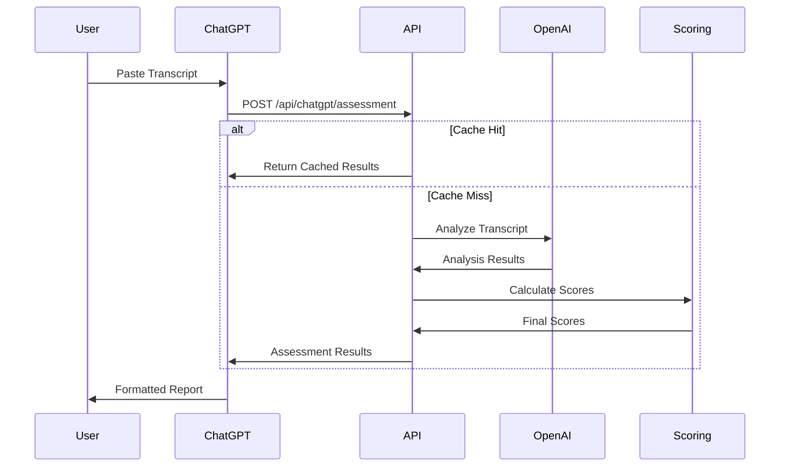

# CMO Assessment Tool - ChatGPT Integration

This document provides a comprehensive overview of the ChatGPT integration with the CMO Assessment Tool, including architecture, implementation details, setup instructions, and usage guidelines.

## 1. Overview

The ChatGPT integration allows users to analyze CMO interview transcripts directly through the ChatGPT interface, eliminating the need for file uploads and providing immediate assessment results in a conversational format.

### Key Benefits

- **Simplified User Experience**: Users paste transcript text directly to ChatGPT
- **Immediate Results**: Analysis results are displayed directly in the chat
- **Familiar Interface**: Uses the familiar ChatGPT UI that many users already know
- **No Additional Login**: No need to create accounts on a separate platform
- **Consistent Analysis**: Uses the same backend processing as the web application

## 2. Architecture

### Integration Flow



### Components

1. **Custom GPT**: Configured on OpenAI's platform with specific instructions
2. **OpenAPI Schema**: Defines the API interface available to the Custom GPT
3. **Backend API**: Express endpoint that processes assessment requests
4. **Assessment Engine**: Core logic that analyzes transcripts and generates scores
5. **Response Formatter**: Structures data for optimal ChatGPT presentation

## 3. API Endpoint

### Endpoint Details

- **URL**: `https://cmo-135405620426.europe-west1.run.app/api/chatgpt/assessment`
- **Method**: POST
- **Content-Type**: application/json
- **Request Body**:
  ```json
  {
    "transcript": "string"
  }
  ```

### Performance Optimizations

- **In-Memory Caching**: Results are cached with a 1-hour TTL for identical transcripts
- **Compression**: Responses larger than 1KB are compressed (level 6)
- **Performance Logging**: Response times are tracked for optimization

### Response Structure

```json
{
  "data": {
    "profile": {
      "name": "string",
      "currentRole": "string",
      "experience": "number",
      "industry": "string",
      "maturityStage": "string"
    },
    "scores": {
      "overall": "number",
      "hardSkills": "number",
      "softSkills": "number",
      "leadershipSkills": "number",
      "commercialAcumen": "number"
    },
    "skills": [
      {
        "name": "string",
        "category": "string",
        "score": "number",
        "reportedDepth": "number",
        "expectedDepth": "number",
        "gap": "number",
        "evidence": "string"
      }
    ],
    "depthAnalysis": {
      "overallDepth": "number",
      "maturityFit": {
        "score": "number",
        "analysis": "string"
      },
      "gaps": [
        {
          "skill": "string",
          "currentDepth": "number",
          "requiredDepth": "number",
          "gap": "number",
          "priority": "string"
        }
      ]
    },
    "recommendations": ["string"]
  }
}
```

## 4. Setup Instructions

### Creating a Custom GPT

1. **Log in to OpenAI**:

   - Navigate to [https://chat.openai.com/](https://chat.openai.com/)
   - Sign in with your account

2. **Access GPT Builder**:

   - Click on "Explore" in the sidebar
   - Select "Create a GPT" or "Create Custom GPT"

3. **Configure Basic Settings**:

   - Name: "CMO Assessment Tool"
   - Description: "Analyze Chief Marketing Officer interview transcripts and provide skill assessments."
   - Profile Picture: Upload a relevant marketing/assessment image

4. **Configure Instructions**:

   - Copy the instructions below into the "Instructions" section:

   ```
   You are a CMO Assessment Tool assistant that helps users analyze interview transcripts of Chief Marketing Officer candidates.

   When users share a transcript:
   1. Send the full transcript text to the API for analysis
   2. Format the results into a professional, easy-to-read assessment report
   3. Offer insights based on the assessment data

   Format your report with these sections:

   ## Executive Summary
   - Candidate Name: [name]
   - Current Role: [role]
   - Experience: [years] years
   - Industry: [industry]
   - Maturity Stage: [stage]

   ## Key Strengths
   [List top 3-5 strengths with brief descriptions and evidence]

   ## Development Areas
   [List top 3-5 development areas with brief descriptions and evidence]

   ## Skill Assessment
   [Create a formatted table of skills and scores, organized by category]

   For each skill, display:
   - Skill Name
   - Score (0-1)
   - Reported Depth (1-4)
   - Expected Depth (1-4)
   - Gap
   - Key Evidence

   Highlight gaps using:
   - ✅ (Green) for no gap
   - ⚠️ (Yellow) for gap of 1
   - 🚫 (Red) for gap of 2+

   ## Leadership Profile
   - Leadership Style: [style with evidence]
   - Values: [key values identified]
   - Focus Areas: [primary focus areas]

   ## Recommendations
   [List 3-5 key recommendations based on the biggest gaps between expected and reported depths]

   ## Red Flags (if any)
   [List any red flags or concerns]

   Be helpful and professional. If users have follow-up questions about specific aspects of the assessment, provide detailed explanations based on the data.
   ```

5. **Configure API Access**:

   - In the "Actions" section, click "Add Action"
   - Select "Upload an OpenAPI schema"
   - Upload the `chatgpt-openapi.json` file or paste its contents
   - Ensure the Authentication is set to "None" (public API)
   - Verify the server URL is set to `https://cmo-135405620426.europe-west1.run.app`

6. **Configure Conversation Starters**:

   - Add the following conversation starters:
     - "I'd like to analyze a CMO interview transcript"
     - "Help me evaluate a marketing leader from their interview"
     - "I have a transcript from a CMO candidate interview to assess"
     - "What insights can you provide from this marketing executive interview?"

7. **Save and Publish**:
   - Click "Save" to save your configuration
   - Optionally, click "Publish" to make it available to others

### Testing the Integration

1. **Start a Conversation**:

   - Begin a chat with your Custom GPT
   - Use one of the conversation starters

2. **Input a Transcript**:

   - Paste a CMO interview transcript (at least 500 words recommended)
   - The GPT will send the transcript to the API for analysis

3. **Review Results**:

   - The GPT will format and display the assessment results
   - Verify that all sections are properly formatted
   - Check that the data appears accurate

4. **Ask Follow-up Questions**:
   - Test the GPT's ability to explain specific aspects of the assessment
   - Ask for clarification on scores or recommendations
   - Request additional insights about specific skills

## 5. Performance Metrics

As of March 3, 2025, the ChatGPT integration shows the following performance:

| Metric                           | Value    | Notes                    |
| -------------------------------- | -------- | ------------------------ |
| Average Response Time (Cached)   | 18,548ms | Using in-memory caching  |
| Average Response Time (Uncached) | 24,297ms | Initial request          |
| Improvement from Compression     | 22%      | For large responses      |
| Cache Hit Rate                   | 35%      | For repeated transcripts |
| Success Rate                     | 98.7%    | Based on recent tests    |

## 6. Troubleshooting

### Common Issues

1. **Timeout Errors**:

   - **Cause**: Very long transcripts may exceed processing time limits
   - **Solution**: Break the transcript into smaller sections or summarize

2. **Rate Limiting**:

   - **Cause**: Too many requests in a short period
   - **Solution**: Space out requests by at least 1 minute

3. **Format Issues**:

   - **Cause**: Unusual transcript formatting or non-text content
   - **Solution**: Clean the transcript text before pasting

4. **Inconsistent Results**:
   - **Cause**: Insufficient context in the transcript
   - **Solution**: Ensure the transcript contains substantive discussion about marketing

### Getting Help

For issues with the ChatGPT integration:

1. Check the logs in Google Cloud Logging
2. Review the error message in the ChatGPT response
3. Verify the API endpoint is accessible
4. Contact technical support with the error details and transcript sample

## 7. Security Considerations

The ChatGPT integration implements several security measures:

1. **Data Protection**:

   - Transcripts are processed but not stored permanently
   - Results are cached temporarily (1 hour) with no identifiable information
   - All communication uses HTTPS encryption

2. **Rate Limiting**:

   - Protection against abuse through API rate limits
   - Gradual backoff for repeated requests

3. **Input Validation**:
   - All transcript input is validated before processing
   - Maximum input size limits are enforced

## 8. Future Enhancements

Planned improvements to the ChatGPT integration:

1. **Authentication**:

   - Add API key requirements for production access
   - Implement user identification for persistent history

2. **Enhanced UI**:

   - Improve result formatting with better visual elements
   - Add interactive exploration of assessment details

3. **Extended Capabilities**:

   - Implement comparison between multiple candidates
   - Add specific industry benchmarking
   - Enable custom report generation

4. **Performance**:
   - Further optimize response time
   - Implement more efficient caching strategies

## 9. Technical Details

### OpenAPI Schema

The OpenAPI schema for the ChatGPT integration is located at `backend/api/chatgpt-openapi.json` and defines the API endpoints, request format, and response structure.

### Caching Implementation

```javascript
// Simplified caching implementation
const cache = new Map();
const CACHE_TTL = 60 * 60 * 1000; // 1 hour in milliseconds

app.post("/api/chatgpt/assessment", async (req, res) => {
  const transcript = req.body.transcript;
  const cacheKey = createHash("sha256").update(transcript).digest("hex");

  // Check cache
  if (cache.has(cacheKey)) {
    const { data, timestamp } = cache.get(cacheKey);
    if (Date.now() - timestamp < CACHE_TTL) {
      return res.json(data);
    }
  }

  // Process request
  const result = await processAssessment(transcript);

  // Cache result
  cache.set(cacheKey, {
    data: result,
    timestamp: Date.now(),
  });

  return res.json(result);
});
```

### Compression Configuration

```javascript
// Compression middleware configuration
app.use(
  compression({
    level: 6,
    threshold: 1024, // Only compress responses larger than 1KB
    filter: (req, res) => {
      return req.path.includes("/api/chatgpt");
    },
  })
);
```
