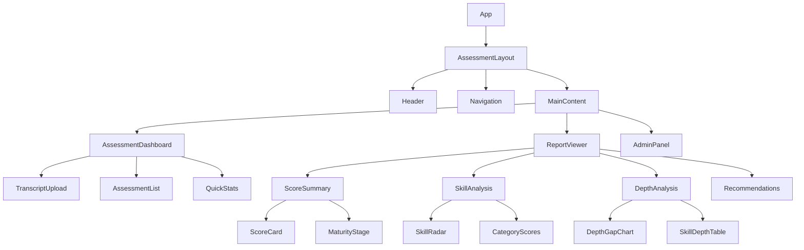
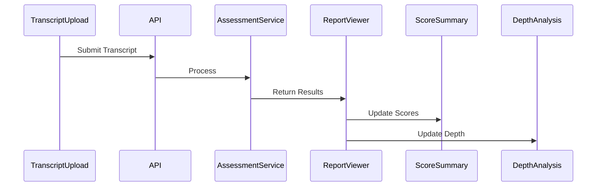
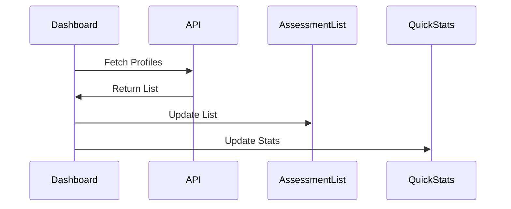

# CMO Assessment Tool - Component Architecture

## 1. Component Hierarchy



## 2. Core Components

### Shared Components

- **ScoreCard**: Displays individual metric scores
- **DataChart**: Base chart component (extends for Radar, Bar charts)
- **StatusBadge**: Shows status/stage indicators
- **ActionButton**: Standardized button component
- **DataTable**: Reusable table component

### Page Components

1. **AssessmentDashboard**

   ```typescript
   interface DashboardProps {
     recentAssessments: Assessment[];
     stats: {
       total: number;
       completed: number;
       inProgress: number;
     };
   }
   ```

2. **ReportViewer**
   ```typescript
   interface ReportProps {
     profileId: string;
     data: CMOProfile;
     scores: {
       overall: number;
       byCategory: Record<string, number>;
     };
     depthAnalysis: DepthAnalysis;
   }
   ```

## 3. Data Flow

### Assessment Flow



### Data Refresh Flow



### API Contract Enforcement

```typescript
// api/types.ts
type APIResponse<T> =
  | {
      data: T;
      error?: never;
    }
  | {
      data?: never;
      error: {
        code: string;
        message: string;
      };
    };

// Strict type checking for API responses
const fetchProfile = async (id: string): Promise<APIResponse<CMOProfile>> => {
  // Implementation with runtime type checking
};
```

## 4. State Management

### Global State

```typescript
interface AppState {
  currentProfile: CMOProfile | null;
  assessmentList: Assessment[];
  uiState: {
    currentView: "dashboard" | "report" | "admin";
    loading: boolean;
    error: Error | null;
  };
}
```

### Local State Examples

```typescript
// Report Viewer
interface ReportViewState {
  activeTab: "summary" | "skills" | "depth" | "recommendations";
  filters: {
    skillCategory: string[];
    depthLevel: number[];
  };
}
```

## 5. Data Visualization

### Chart Components

1. **SkillRadarChart**

   - Displays skill category scores
   - Uses Recharts RadarChart
   - Color-coded by threshold

2. **DepthGapChart**
   - Shows depth level gaps
   - Uses Recharts BarChart
   - Includes target indicators

### Data Tables

1. **SkillsTable**

   - Sortable columns
   - Filterable by category
   - Score highlighting

2. **RecommendationsTable**
   - Priority sorting
   - Category grouping
   - Action tracking

## 6. Implementation Phases

### Phase 1: Core Structure

1. Base layout components
2. Navigation setup
3. Basic data display

### Phase 2: Data Integration

1. API service connection
2. State management
3. Error handling

### Phase 3: Advanced Features

1. Data visualization
2. PDF export
3. Admin features

## 7. Component Guidelines

### Principles

1. Single Responsibility
2. Prop Type Validation
3. Error Boundary Implementation
4. Accessibility Standards

### Code Structure

```typescript
import { type FC } from "react";
import type { ComponentProps } from "./types";

export const Component: FC<ComponentProps> = ({ data, onAction }) => {
  // Implementation
};
```

### Testing Strategy

1. Unit tests for shared components
2. Integration tests for data flow
3. Snapshot tests for UI consistency

## 8. Application Entry & Routing

### Root Structure

```typescript
// App.tsx - Main Entry Point
const App: FC = () => {
  return (
    <ErrorBoundary fallback={<ErrorPage />}>
      <AuthProvider>
        <Router>
          <AssessmentLayout>
            <Routes>
              <Route path="/" element={<AssessmentDashboard />} />
              <Route path="/report/:id" element={<ReportViewer />} />
              <Route path="/admin" element={<AdminPanel />} />
            </Routes>
          </AssessmentLayout>
        </Router>
      </AuthProvider>
    </ErrorBoundary>
  );
};
```

### Error Boundaries

```typescript
interface ErrorBoundaryProps {
  children: React.ReactNode;
  fallback: React.ReactNode;
}

const ComponentErrorBoundary: FC<ErrorBoundaryProps> = ({
  children,
  fallback,
}) => {
  // Implementation
};
```

## 9. Responsive Design Strategy

### Breakpoints

```typescript
const breakpoints = {
  mobile: "320px",
  tablet: "768px",
  desktop: "1024px",
  wide: "1280px"
};

### Layout Components
- **ResponsiveContainer**: Manages width and padding
- **FlexGrid**: Responsive grid system
- **AdaptiveChart**: Resizes visualizations
```
