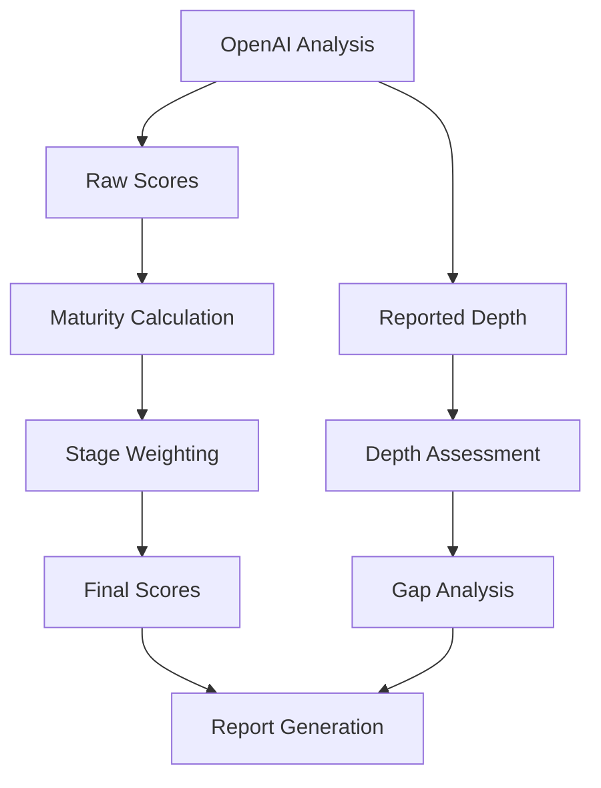

# CMO Assessment Tool - Scoring System Specification

This document provides a comprehensive specification of the CMO Assessment Tool's scoring system, including maturity scores, depth levels, and gap analysis algorithms.

## 1. Scoring Components

The scoring system consists of four main components:

1. **Raw Skill Scores**: Initial scores (0-1 scale) derived from OpenAI analysis
2. **Depth Level Analysis**: Evaluation of skill depth (Levels 1-4)
3. **Maturity Score Calculation**: Weighted scoring based on maturity stage
4. **Gap Analysis**: Identification of areas for improvement

## 2. Raw Skill Scores

### Source

Raw scores are generated by the OpenAI analysis of the transcript:

```javascript
rawScore = OpenAIResponse.skills[category][skill].score;
```

### Structure

```json
{
  "hardSkills": {
    "marketing_strategy": {
      "score": 0.9,
      "reportedDepth": 3,
      "evidence": ["string"]
    }
  }
}
```

### Validation Rules

- All scores must be between 0 and 1
- All skills must include a score
- Evidence should be provided for non-zero scores

## 3. Depth Level System

### Depth Level Definitions

| Level | Name                                 | Description                                                              |
| ----- | ------------------------------------ | ------------------------------------------------------------------------ |
| 1     | **Strategic Understanding**          | High-level insight, setting goals, aligning with investor/board strategy |
| 2     | **Managerial/Operational Oversight** | Ability to evaluate tactics, manage execution without being hands-on     |
| 3     | **Conversational Proficiency**       | Fluency in technical details; able to discuss and identify issues        |
| 4     | **Executional Expertise**            | Hands-on proficiency; deeply involved in executing technical tasks       |

### Maturity Stage Mapping

Different company maturity stages require different depth levels for each skill:

| Maturity Stage | Primary Depth Focus      | Example                                                        |
| -------------- | ------------------------ | -------------------------------------------------------------- |
| Early-Stage    | Level 4 (Executional)    | CMO needs hands-on skills to execute technical marketing tasks |
| Growth         | Level 3 (Conversational) | CMO needs to understand details to manage growing team         |
| Scale-Up       | Level 2 (Managerial)     | CMO focuses more on oversight and less on execution            |
| Enterprise     | Level 1 (Strategic)      | CMO primarily focuses on strategic direction                   |

### Depth Configuration

Depth requirements are stored in `backend/config/depthLevels.json`:

```json
{
  "Early-Stage": {
    "hardSkills": {
      "marketing_strategy": 4,
      "digital_marketing": 4
    }
  },
  "Growth": {
    "hardSkills": {
      "marketing_strategy": 3,
      "digital_marketing": 3
    }
  }
}
```

### Depth Analysis Algorithm

```javascript
function assessDepthLevels(skills, maturityStage) {
  const depthAnalysis = {};

  Object.entries(skills).forEach(([category, skills]) => {
    Object.entries(skills).forEach(([skillName, skillData]) => {
      const reportedDepth = skillData.reportedDepth || skillData.depth || 1;
      const expectedDepth =
        DEPTH_LEVELS[maturityStage]?.[category]?.[skillName] || 1;

      depthAnalysis[category] = depthAnalysis[category] || {};
      depthAnalysis[category][skillName] = {
        reportedDepth,
        expectedDepth,
        gap: Math.max(0, expectedDepth - reportedDepth),
      };
    });
  });

  return depthAnalysis;
}
```

## 4. Maturity Score Calculation

### Stage Weights

Maturity stage weights are stored in `backend/config/benchmarks.json`:

```json
{
  "Growth": {
    "hardSkills": 0.7,
    "softSkills": 0.6,
    "leadershipSkills": 0.8,
    "commercialAcumen": 0.5
  }
}
```

### Calculation Formula

```math
MaturityScore = Σ(CategoryScore × CategoryWeight) / ΣCategoryWeights
```

### Implementation

```javascript
function calculateMaturityScore(skills, stage) {
  const weights = STAGE_WEIGHTS[stage] || STAGE_WEIGHTS["Growth"];
  let totalScore = 0;
  let totalWeight = 0;

  Object.entries(skills).forEach(([category, clusterSkills]) => {
    // Calculate average score for the category
    const clusterScore =
      Object.values(clusterSkills).reduce(
        (sum, skill) => sum + skill.scores.raw,
        0
      ) / Object.keys(clusterSkills).length;

    // Apply weight
    totalScore += clusterScore * weights[category];
    totalWeight += weights[category];
  });

  return totalScore / totalWeight;
}
```

## 5. Gap Analysis

### Gap Calculation

```javascript
function calculateSkillGaps(skills, targetWeights, stage) {
  const gaps = {
    hardSkills: {},
    softSkills: {},
    leadershipSkills: {},
    commercialAcumen: {},
  };

  ["hardSkills", "softSkills", "leadershipSkills", "commercialAcumen"].forEach(
    (category) => {
      if (skills[category]) {
        Object.entries(skills[category]).forEach(([skill, skillData]) => {
          const expectedDepth = DEPTH_LEVELS[stage]?.[category]?.[skill] || 1;
          const actualDepth = skillData.reportedDepth || skillData.depth || 1;

          // Calculate gap
          gaps[category][skill] = Math.max(0, expectedDepth - actualDepth);
        });
      }
    }
  );

  return gaps;
}
```

### Depth Gap Interpretation

| Gap Size | Interpretation       | Recommendation Priority |
| -------- | -------------------- | ----------------------- |
| 0        | Meeting expectations | Low                     |
| 1        | Minor gap            | Medium                  |
| 2        | Significant gap      | High                    |
| 3        | Critical gap         | Urgent                  |

## 6. Data Flow



## 7. Report Generation

### Score Reporting Structure

```json
{
  "overallScore": 0.85,
  "categories": {
    "hardSkills": 0.7,
    "softSkills": 0.6,
    "leadershipSkills": 0.8,
    "commercialAcumen": 0.75
  },
  "depthAnalysis": {
    "hardSkills": {
      "marketing_strategy": {
        "reportedDepth": 3,
        "expectedDepth": 4,
        "gap": 1,
        "priorityLevel": "medium"
      }
    }
  },
  "recommendations": ["Develop execution-level marketing strategy skills"]
}
```

### Skill Report Structure

Each skill in the detailed report should include both reported and expected depth levels:

```json
"skills": [
  {
    "name": "Marketing Strategy",
    "category": "hardSkills",
    "score": 0.92,
    "reportedDepth": 3,
    "expectedDepth": 4,
    "gap": 1,
    "evidence": "Demonstrated strong strategic thinking in campaign planning..."
  }
]
```

### Categorization by Depth Level

Skills are also categorized by their depth level for reporting:

```javascript
function populateDepthAnalysis(skills) {
  const depthAnalysis = {
    strategic: { level: 1, skills: [], evidence: [] },
    managerial: { level: 2, skills: [], evidence: [] },
    conversational: { level: 3, skills: [], evidence: [] },
    executional: { level: 4, skills: [], evidence: [] },
  };

  // Map depth levels to their corresponding categories
  const depthMap = {
    1: "strategic",
    2: "managerial",
    3: "conversational",
    4: "executional",
  };

  // Process each skill category and skill
  Object.entries(skills).forEach(([category, skillSet]) => {
    Object.entries(skillSet).forEach(([skillName, skillData]) => {
      if (skillData.score <= 0) return;

      const reportedDepth = skillData.reportedDepth || skillData.depth || 1;
      const depthCategory = depthMap[reportedDepth];

      if (depthCategory) {
        depthAnalysis[depthCategory].skills.push({
          name: skillName,
          category: category,
          score: skillData.score,
        });

        // Add evidence if available
        if (skillData.evidence && skillData.evidence.length > 0) {
          const relevantEvidence = skillData.evidence
            .slice(0, 2)
            .map((item) => `${skillName}: ${item}`);
          depthAnalysis[depthCategory].evidence.push(...relevantEvidence);
        }
      }
    });
  });

  return depthAnalysis;
}
```

## 8. Key Principles

1. **Score Integrity**

   - Raw scores are never modified after OpenAI analysis
   - Depth gaps don't affect numerical scores directly
   - Stage weights only applied during final calculation

2. **Depth Analysis**

   - Serves as a diagnostic tool
   - Shows alignment with stage expectations
   - Gaps are calculated as Expected - Reported (min 0)

3. **Validation Rules**
   - Stage must exist in both benchmarks and depthLevels
   - Skills must contain all 4 categories
   - Depth levels must be integers between 1-4

## 9. Example Scenario

**Transcript Analysis Result**:

```json
"skills": {
  "hardSkills": {
    "marketing_strategy": {
      "score": 0.9,
      "reportedDepth": 3
    }
  }
}
```

**Benchmarks (Growth)**:

```json
"hardSkills": 0.7
```

**Depth Levels (Growth)**:

```json
"marketing_strategy": 4
```

**Result Calculation**:

- Maturity Contribution: `0.9 * 0.7 = 0.63`
- Reported Depth: `3`
- Expected Depth: `4`
- Depth Gap: `4 - 3 = 1`
- Recommendation: "Develop executional expertise in marketing strategy"

**Report Output**:

```json
{
  "skills": {
    "hardSkills": {
      "marketing_strategy": {
        "score": 0.9,
        "reportedDepth": 3,
        "expectedDepth": 4,
        "gap": 1,
        "evidence": ["Quote from transcript..."]
      }
    }
  },
  "recommendations": ["Develop executional expertise in marketing strategy"]
}
```

## 10. Implementation Considerations

1. **Performance Optimization**

   - Cache results for repeated analyses
   - Calculate scores incrementally
   - Optimize depth analysis for large skill sets

2. **Error Handling**

   - Provide fallbacks for missing configuration
   - Validate all inputs before processing
   - Log warnings for potential scoring issues

3. **Extensibility**
   - Allow for custom scoring algorithms
   - Support new skill categories
   - Enable custom depth level definitions
