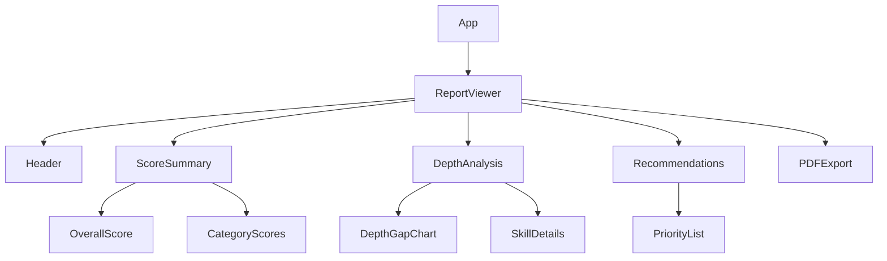

# CMO Assessment Tool - UI Specification

## Core Requirements

### 1. Report Viewer

- **Sections**:

  1. Executive Summary
  2. Skill Maturity Scores
  3. Depth Gap Analysis
  4. Recommendations

- **Data Sources**:
  ```javascript
  {
    "scores": {
      "overall": 0.85,
      "hardSkills": 0.7,
      "softSkills": 0.6,
      "leadership": 0.8,
      "commercial": 0.75
    },
    "depthGaps": [
      {
        "skill": "marketing_strategy",
        "currentDepth": 3,
        "requiredDepth": 4,
        "gap": 1
      }
    ],
    "recommendations": [
      "Develop execution-level marketing strategy skills"
    ]
  }
  ```

### 2. Visualization Components

- **Radar Chart**: Skill category scores
- **Bar Chart**: Depth gaps per skill
- **Score Cards**: Overall and category scores
- **Recommendation List**: Prioritized actions

### 3. PDF Export

- Preserve layout and styling
- Include all report sections
- Add timestamp and version info

## Tech Stack

- **Framework**: React + Vite
- **Charting**: Recharts
- **PDF**: React-PDF
- **Styling**: Tailwind CSS
- **State**: Context API

## Component Structure



## Development Plan

### Phase 1: Core Components

1. Setup Vite project
2. Create base layout
3. Implement score cards
4. Add radar chart

### Phase 2: Data Integration

1. Connect to assessment service
2. Load sample reports
3. Add error handling

### Phase 3: Polish & Export

1. Style refinement
2. PDF layout
3. Accessibility checks

## Sample Component Code

```javascript
// ScoreCard.jsx
export default function ScoreCard({ title, score }) {
  return (
    <div className="score-card">
      <h3>{title}</h3>
      <div className="score-value">{Math.round(score * 100)}%</div>
    </div>
  );
}
```
