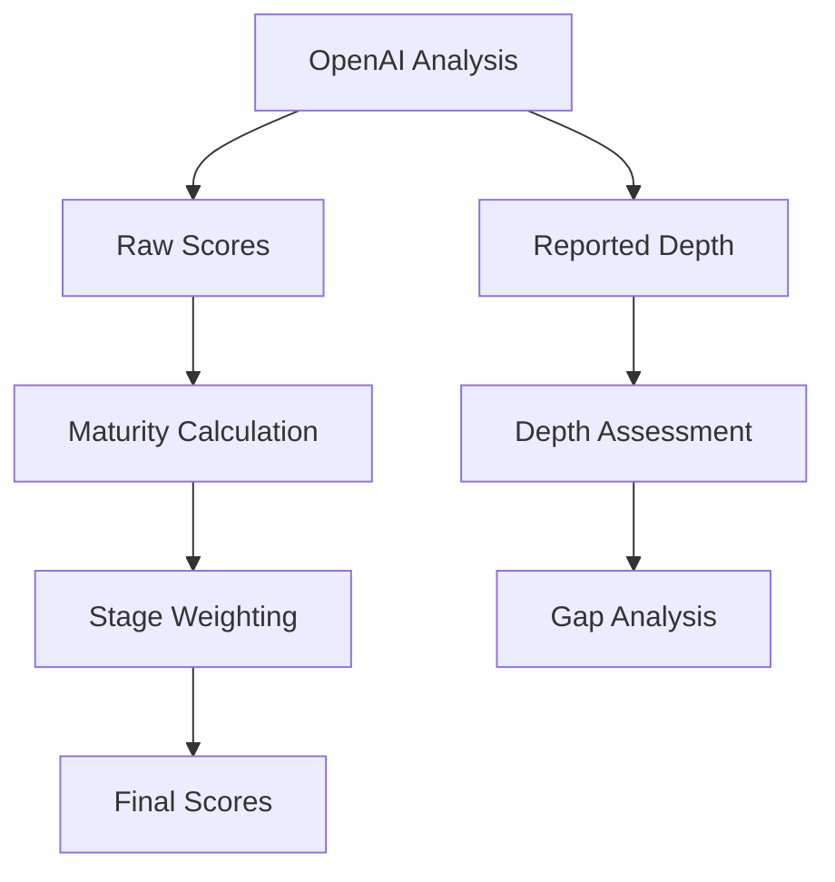

# CMO Assessment Algorithm Specification

## Core Components

### 1. Skill Scores

- **Source**: Raw scores (0-1 scale) from OpenAI analysis
- **Calculation**:
  ```javascript
  rawScore = OpenAI.analyze(transcript).skills[category][skill].score;
  ```
- **Storage**:
  ```json
  {
    "hardSkills": {
      "marketing_strategy": {
        "score": 0.9,
        "reportedDepth": 3,
        "evidence": ["string"]
      }
    }
  }
  ```

### 2. Stage Weights (Benchmarks)

- **File**: `config/benchmarks.json`
- **Structure**:
  ```json
  {
    "Growth": {
      "hardSkills": 0.7,
      "softSkills": 0.6,
      "leadershipSkills": 0.8,
      "commercialAcumen": 0.5
    },
    "Scaling": {
      "hardSkills": 0.8,
      "softSkills": 0.7,
      "leadershipSkills": 0.9,
      "commercialAcumen": 0.6
    }
  }
  ```

### 3. Maturity Score Calculation

```math
MaturityScore = Σ(CategoryScore × CategoryWeight) / ΣCategoryWeights
```

**Steps**:

1. Calculate category average:
   ```javascript
   categoryScore = average(skill.score for all skills in category)
   ```
2. Apply stage weight:
   ```javascript
   weightedScore = categoryScore × benchmarks[stage][category]
   ```
3. Sum all weighted scores

**Example**:

```javascript
// For Growth stage
hardSkillsScore = 0.9 * 0.7 = 0.63
softSkillsScore = 0.8 * 0.6 = 0.48
Total = (0.63 + 0.48) / (0.7 + 0.6) = 0.85
```

### 4. Depth Assessment

- **Expected Values**: `config/depthLevels.json`
- **Reported Values**: From OpenAI analysis (`reportedDepth`)
- **Gap Calculation**:
  ```javascript
  gap = Math.max(0, expectedDepth - reportedDepth);
  ```
- **Storage**:
  ```json
  "depthAnalysis": {
    "hardSkills": {
      "marketing_strategy": {
        "reportedDepth": 3,
        "expectedDepth": 4,
        "gap": 1
      }
    }
  }
  ```

## Data Flow



## Key Principles

1. **Score Integrity**:

   - Raw scores never modified after OpenAI analysis
   - Depth gaps don't affect numerical scores
   - Stage weights only applied during final calculation

2. **Depth Analysis**:

   - Purely diagnostic/descriptive
   - Shows alignment with stage expectations
   - Gap = Expected - Reported (min 0)

3. **Validation Rules**:
   - Stage must exist in both benchmarks and depthLevels
   - Skills must contain all 4 categories
   - Depth levels must be 1-4 integers

## Example Scenario

**Transcript Analysis**:

```json
"skills": {
  "hardSkills": {
    "marketing_strategy": {
      "score": 0.9,
      "depth": 3
    }
  }
}
```

**Benchmarks (Growth)**:

```json
"hardSkills": 0.7
```

**Depth Levels (Growth)**:

```json
"marketing_strategy": 4
```

**Results**:

- Maturity Contribution: `0.9 * 0.7 = 0.63`
- Depth Gap: `4 - 3 = 1`
