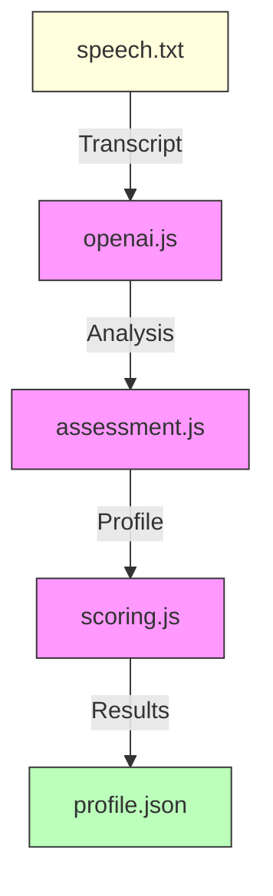

```mermaid
graph TD
    A[speech.txt] -->|Transcript| B[openai.js]
    B -->|Analysis| C[assessment.js]
    C -->|Profile| D[scoring.js]
    D -->|Results| E[profile.json]

    classDef input fill:#ffd,stroke:#333
    classDef service fill:#f9f,stroke:#333
    classDef output fill:#bfb,stroke:#333

    class A input
    class B,C,D service
    class E output
```
